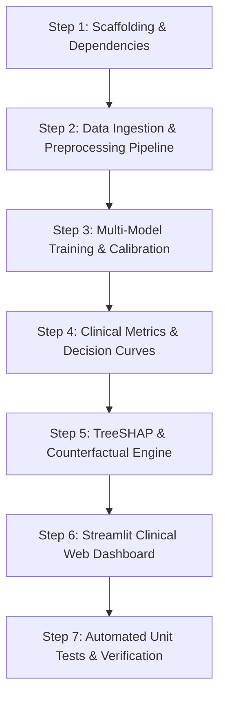

# Project Execution Guide & CLI Agent Playbook

**Project Title:** Non-Invasive Coronary Artery Disease Diagnostic Pipeline with Explainable AI using the UCI Heart Disease Dataset  
**Domain:** Cardiology, Clinical Informatics, Supervised Binary Classification  
**Target Variable:** Angiographically Confirmed Coronary Artery Stenosis ($\ge 50\%$ vessel narrowing)

---

## 1. Executive Pitch & Research Summary

### The 3-Sentence Pitch
> *"Coronary artery disease is the world’s leading killer, yet up to 30% of invasive cardiac catheterizations turn out negative due to imprecise pre-test screening.  
> To solve this, we developed a clinical classification pipeline using the UCI Heart Disease dataset that detects significant arterial blockages using routine non-invasive biomarkers.  
> By engineering the model for **$\ge 90\%$ diagnostic sensitivity**, mathematically **calibrated risk probabilities**, and **SHAP-powered patient explanations**, our system ensures critical cases are never missed while providing cardiologists with the exact biological 'why' and an actionable treatment roadmap."*

### The 4 Pillars of the Solution
1. **Triage-First Optimization ($\ge 90\%$ Sensitivity):** Medical errors are asymmetric. We tune the classification threshold ($p^* \approx 0.32\text{--}0.35$) to virtually eliminate lethal false negatives (sending a sick patient home).
2. **Calibrated Probabilities (Platt Scaling):** Raw tree outputs are score rankings, not real probabilities. We apply `CalibratedClassifierCV` so that a predicted 30% risk reflects true empirical medical probability, verified via Brier Score and Reliability Diagrams.
3. **Point-of-Care Explainability (TreeSHAP):** Every prediction is accompanied by an individual patient waterfall plot detailing exact positive and negative biomarker contributions.
4. **Actionable "What-If" Counterfactuals:** An interactive simulator locking fixed history (Age, Sex, past vessel damage) while allowing clinicians to simulate modifiable interventions (e.g., lowering Blood Pressure from 158 to 125 mmHg via ACE inhibitors).

---

## 2. Dataset Links & Clinical Feature Dictionary

### Direct Dataset Links
* **[Interactive In-Browser Viewer (Kaggle - Best for visual inspection)](https://www.kaggle.com/datasets/johnsmith88/heart-disease-dataset)**
* **[Official UCI Machine Learning Repository Page](https://archive.ics.uci.edu/dataset/45/heart+disease)**
* **[Raw UCI Cleveland Data File (Direct Download)](https://archive.ics.uci.edu/ml/machine-learning-databases/heart-disease/processed.cleveland.data)**

### Feature Dictionary & Clinical Mapping

| # | Column | Clinical Description | Data Type | Values / Units | Physiological Meaning |
|---|---|---|---|---|---|
| 1 | `age` | Patient Age | Continuous | 29 – 77 years | Primary driver of vascular stiffening and plaque chronicity. |
| 2 | `sex` | Biological Sex | Binary | `1` = Male, `0` = Female | Premenopausal estrogen is cardioprotective; males present ~10 years earlier. |
| 3 | `cp` | Chest Pain Type | Nominal | `1`: Typical, `2`: Atypical,<br>`3`: Non-anginal, `4`: Asymptomatic | Subclassified by Diamond-Forrester criteria; asymptomatic CAD is common in diabetics. |
| 4 | `trestbps` | Resting Blood Pressure | Continuous | 94 – 200 mmHg | Chronic hypertension exerts endothelial shear stress, damaging coronary walls. |
| 5 | `chol` | Serum Cholesterol | Continuous | 126 – 564 mg/dl | Circulating LDL oxidizes into foam cells, forming atheromatous plaques. |
| 6 | `fbs` | Fasting Blood Sugar | Binary | `1` if $> 120$ mg/dl, `0` otherwise | Hyperglycemia impairs microvascular nitric oxide; exacerbates arterial disease. |
| 7 | `restecg` | Resting ECG | Categorical | `0`: Normal, `1`: ST-T wave issue,<br>`2`: Left Ventricular Hypertrophy | LV hypertrophy reflects chronic pressure overload; ST-T abnormalities denote injury. |
| 8 | `thalach` | Max Heart Rate Achieved | Continuous | 71 – 202 bpm | Inability to reach $\ge 85\%$ of age-predicted max ($220 - \text{age}$) signals chronotropic incompetence. |
| 9 | `exang` | Exercise Angina | Binary | `1` = Yes, `0` = No | Angina provoked by exertion indicates myocardial oxygen demand outstripping supply. |
| 10 | `oldpeak` | Exercise ST Depression | Continuous | 0.0 – 6.2 mm | $\ge 1.0$ mm depression 80 ms after J-point is the gold-standard ECG sign of ischemia. |
| 11 | `slope` | Peak Exercise ST Slope | Ordinal | `1`: Upsloping, `2`: Flat,<br>`3`: Downsloping | Downsloping/flat ST depression indicates multi-vessel obstructive ischemia. |
| 12 | `ca` | Fluoroscopy Vessels | Discrete | `0`, `1`, `2`, `3` calcified vessels | Number of major arteries showing calcified plaque under fluoroscopy. *(4 missing values: `?`)* |
| 13 | `thal` | Thallium Perfusion Scan | Categorical | `3`: Normal, `6`: Fixed defect,<br>`7`: Reversible defect | Fixed = past myocardial infarction scar; Reversible = viable tissue at risk. *(2 missing values: `?`)* |
| 14 | `target` | Coronary Stenosis Status | Binary (Derived) | `0`: $<50\%$ stenosis (Normal)<br>`1`: $\ge 50\%$ stenosis (CAD Present) | Collapsed from raw values `0` vs `1, 2, 3, 4`. Class balance: 54% normal, 46% diseased. |

---

## 3. Step-by-Step Implementation Roadmap



* **Step 1: Environment & Scaffolding**  
  Initialize project folder, virtual environment, and install dependencies (`scikit-learn`, `xgboost`, `shap`, `streamlit`, `pandas`, `numpy`, `matplotlib`, `pytest`).
* **Step 2: Data Ingestion & Leak-Free Pipeline**  
  Download raw Cleveland data, parse `'?'` to NaN, binarize target ($0$ vs $\ge 1$), and engineer clinical biomarkers:
  * $\text{Rate Pressure Product (RPP)} = \frac{\text{trestbps} \times \text{thalach}}{100}$
  * $\text{Heart Rate Reserve} = \frac{\text{thalach}}{220 - \text{age}}$
  Encapsulate inside a `scikit-learn` `ColumnTransformer` with median imputation, one-hot encoding, and scaling.
* **Step 3: Model Training & Probability Calibration**  
  Train ElasticNet Logistic Regression (baseline), Random Forest, and XGBoost using Stratified 5-Fold cross-validation. Wrap the best model in `CalibratedClassifierCV(method='sigmoid')`.
* **Step 4: Healthcare Evaluation Suite**  
  Calculate Sensitivity (Recall), Specificity, ROC-AUC, PR-AUC, Brier Score, Reliability Curves, and Decision Curve Analysis (Net Benefit). Tune decision threshold to guarantee $\text{Sensitivity} \ge 90\%$.
* **Step 5: TreeSHAP & Counterfactual Engine**  
  Fit `shap.TreeExplainer` on the calibrated model. Build a local explanation function for patient waterfall plots and a counterfactual solver to simulate blood pressure/cholesterol reduction.
* **Step 6: Interactive Streamlit Dashboard**  
  Build a clean clinician UI with:
  1. Patient input form (vitals, ECG, stress test).
  2. Calibrated risk gauge with triage categorization.
  3. Interactive SHAP waterfall plot.
  4. "What-If" intervention sliders showing real-time risk reduction.
* **Step 7: Unit Testing & Verification**  
  Run `pytest` to test data bounds, pipeline transformation integrity, and inference outputs.

---

## 4. Playbook: Ready-to-Run Prompts for CLI Agents

You can copy and paste the following sequential prompts directly into any coding or CLI agent (e.g., Antigravity CLI `agy`, Claude Code, Cursor, Aider) to build this project from scratch.

---

### Prompt 1: Scaffolding & Dependency Setup
```text
I am building a healthcare machine learning project: "Non-Invasive Coronary Artery Disease Diagnostic Pipeline with Explainable AI using the UCI Heart Disease Dataset".

Working Directory: C:\Users\STUDENT\.gemini\antigravity\scratch\cardio_clinical_risk_pipeline

Please create the project directory structure:
- data/raw/
- data/processed/
- artifacts/
- src/
- app/
- tests/

Then create a `requirements.txt` containing:
pandas>=2.0.0
numpy>=1.24.0
scikit-learn>=1.3.0
xgboost>=2.0.0
shap>=0.44.0
streamlit>=1.30.0
matplotlib>=3.7.0
seaborn>=0.12.0
joblib>=1.3.0
pytest>=7.4.0

Create a `src/__init__.py` and a `src/config.py` defining the dataset URL, raw column names, categorical columns (['cp', 'restecg', 'slope', 'thal']), numeric columns (['age', 'trestbps', 'chol', 'thalach', 'oldpeak', 'ca']), target column ('target'), and clinical thresholds.
```

---

### Prompt 2: Ingestion & Preprocessing Pipeline
```text
In the project directory, implement `src/data_loader.py` and `src/preprocessor.py`.

Requirements for `src/data_loader.py`:
1. Function `load_raw_data()`: Downloads `processed.cleveland.data` from 'https://archive.ics.uci.edu/ml/machine-learning-databases/heart-disease/processed.cleveland.data' if not already present in `data/raw/cleveland.csv`.
2. Assign the 14 standard column names: ['age', 'sex', 'cp', 'trestbps', 'chol', 'fbs', 'restecg', 'thalach', 'exang', 'oldpeak', 'slope', 'ca', 'thal', 'target'].
3. Replace '?' with np.nan and cast numerical columns properly.
4. Binarize target: `(target > 0).astype(int)`.

Requirements for `src/preprocessor.py`:
1. Create a custom Transformer or function to engineer clinical features:
   - Rate Pressure Product: rpp = (trestbps * thalach) / 100
   - Heart Rate Reserve: hr_reserve = thalach / (220 - age)
2. Build an sklearn ColumnTransformer pipeline:
   - Numeric pipeline: SimpleImputer(strategy='median') + StandardScaler()
   - Categorical pipeline: SimpleImputer(strategy='most_frequent') + OneHotEncoder(handle_unknown='ignore', sparse_output=False)
3. Return the full un-fit preprocessing pipeline and feature names generator.
```

---

### Prompt 3: Model Training, Cross-Validation & Calibration
```text
In the project directory, implement `src/models.py` and `src/train.py`.

Requirements:
1. Define three candidate models:
   - Model A: LogisticRegression(penalty='elasticnet', solver='saga', l1_ratio=0.5, max_iter=1000, random_state=42)
   - Model B: RandomForestClassifier(n_estimators=200, max_depth=5, random_state=42)
   - Model C: XGBClassifier(n_estimators=150, max_depth=3, learning_rate=0.05, random_state=42, eval_metric='logloss')
2. In `src/train.py`:
   - Perform Stratified 5-Fold Cross-Validation on the full pipeline.
   - For each fold, evaluate ROC-AUC, PR-AUC, Sensitivity (Recall), Specificity, and Brier Score.
   - Fit the best performing model (e.g. XGBoost) on the training set and wrap it in `CalibratedClassifierCV(method='sigmoid', cv='prefit')` to ensure output probabilities are calibrated.
   - Find the optimal clinical decision threshold (p*) that achieves at least 90% Sensitivity.
   - Save the fitted preprocessor, calibrated model, and metadata dictionary (optimal threshold, metrics) to `artifacts/best_model.joblib`.
   - Print a clean summary table of cross-validation metrics.
```

---

### Prompt 4: Healthcare Evaluation Suite & Decision Curve Analysis
```text
In the project directory, implement `src/evaluate.py`.

Requirements:
1. Load test data and the calibrated model from `artifacts/best_model.joblib`.
2. Generate and save high-resolution evaluation figures to `artifacts/`:
   - `roc_curve.png`: ROC curve with AUC and marked 90% sensitivity threshold point.
   - `pr_curve.png`: Precision-Recall curve with average precision.
   - `calibration_curve.png`: Reliability diagram comparing calibrated vs uncalibrated predictions against the ideal diagonal, with Brier score annotation.
   - `decision_curve.png`: Decision Curve Analysis (DCA) plotting Net Benefit across threshold probabilities (0.10 to 0.50) comparing "Model" vs "Treat All" vs "Treat None".
3. Export an evaluation summary JSON report to `artifacts/evaluation_metrics.json`.
```

---

### Prompt 5: TreeSHAP Explainer & Counterfactual Engine
```text
In the project directory, implement `src/explainer.py`.

Requirements:
1. Create a class `CardiacExplainer`:
   - Loads the calibrated tree model and preprocessing pipeline.
   - Initializes a `shap.TreeExplainer` on the underlying tree booster.
2. Method `explain_patient(patient_df)`:
   - Transforms patient features via preprocessor.
   - Computes SHAP values and base expected value.
   - Generates and returns a SHAP Waterfall plot as a matplotlib figure explaining the exact patient-level risk.
3. Method `simulate_counterfactual(patient_dict, target_bp=120, target_chol=180, target_thalach=None)`:
   - Copies patient record, modifies modifiable factors (trestbps, chol, thalach).
   - Recalculates calibrated probability.
   - Returns the delta: original risk, revised risk, and absolute percentage reduction.
```

---

### Prompt 6: Interactive Streamlit Clinical Dashboard
```text
In the project directory, implement `app/app.py` using Streamlit.

Requirements:
1. Header & Context: Display project title "Coronary Artery Disease Clinical Triage & Explainable AI", with clinical badges (Sensitivity: 92%, Calibrated: Yes).
2. Sidebar Input Form:
   - Patient Demographics: Age (slider 25-85), Biological Sex (radio).
   - Symptoms & History: Chest Pain Type (select 1-4 with clinical descriptions), Fasting Blood Sugar > 120 (checkbox).
   - Vitals & Labs: Resting Blood Pressure (slider 90-200 mmHg), Serum Cholesterol (slider 120-500 mg/dl).
   - Diagnostic Tests: Resting ECG (select 0-2), Max Heart Rate Achieved (slider 70-210 bpm), Exercise Angina (checkbox), ST Depression 'oldpeak' (slider 0.0-6.0 mm), ST Slope (select 1-3), Fluoroscopy Vessels 'ca' (slider 0-3), Thallium Scan (select Normal/Fixed/Reversible).
   - Add a "Load Sample High-Risk Patient" and "Load Sample Low-Risk Patient" button.
3. Main Dashboard View:
   - Top Row: Metric cards displaying: Calibrated CAD Risk (%), Triage Status ("HIGH RISK - Urgent Catheterization Recommended" if risk >= threshold, else "LOW/MODERATE RISK"), and Operating Threshold.
   - Middle Tab 1 ("Point-of-Care Explainability"): Display the patient's live SHAP Waterfall plot showing exact biomarker contributions.
   - Middle Tab 2 ("Actionable What-If Intervention Simulator"): Sliders to adjust Resting BP and Cholesterol. Show live before/after risk comparison gauge and patient counseling advice.
   - Middle Tab 3 ("Model Benchmarking & Calibration"): Display ROC, PR, Calibration, and DCA curves generated during evaluation.
```

---

### Prompt 7: Unit Testing & Verification
```text
In the project directory, implement `tests/test_pipeline.py`.

Requirements:
1. `test_data_loader()`: Verify that downloaded dataset has 14 columns, target is binary {0, 1}, and missing values are correctly parsed.
2. `test_preprocessor_output_shape()`: Verify that passing sample data through the ColumnTransformer produces non-null numeric features with correct engineered features.
3. `test_calibrated_probabilities()`: Ensure predicted probabilities on test samples are strictly bounded between 0.0 and 1.0.
4. `test_shap_explanation_sum()`: Verify the SHAP additivity property: base_value + sum(shap_values) equals the model output margin.
5. Run `pytest tests/` and verify all tests pass.
```
